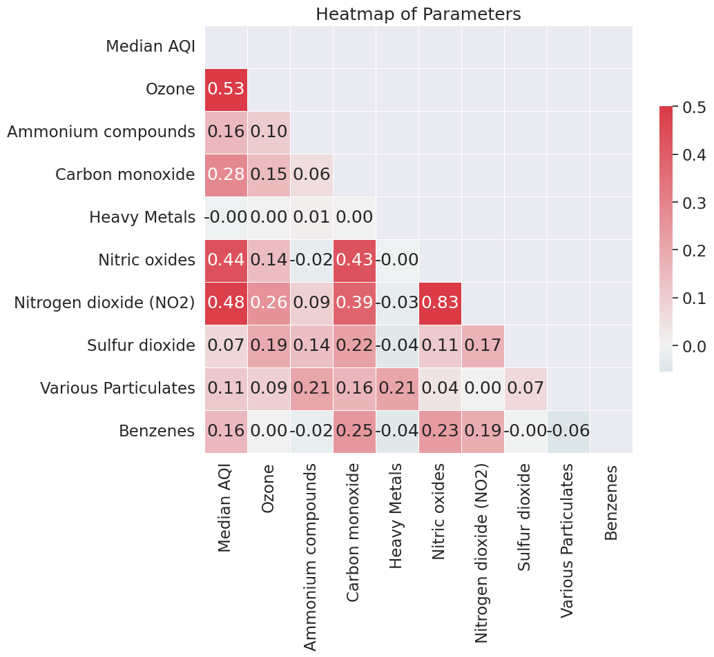

# Introduction

As time proceeds, pollution from industries is steadily making the air quality in our atmosphere worse, due to pollutants from manufacturing. As a group, we were interested in how different parameters can effect regional air quality both instantaneously and over time, and also how those parameters can effect asthma prevalence. 

# Exploratory Data Analysis

> A summary of the **highlights** of your EDA, where you can show some visualizations of the exploratory data analysis your group did.

For our exploratory analysis, we mostly focused on wether or not there were any correlations that we were expecting, or not expecting. To do that, one of the things we did was aggregate the different air quality parameters into heatmap, which did indicate that some of the expected correlations are there. Furthermore, a choropleth of AQI by region, and point based asthma prevalence was generated to check if there were any potential trends, or if it was truly random. These plots are shown below:

# Questions and Results

## Question 1

> Clearly state your research question, and include 2-3 visualizations that helped you answer your research question. You can create multi-panel figures, but each of your visualizations must speak directly to your research question, and any insights you were able to get from it should be clearly articulated in the figure caption/description.

## Question 2

> Same as above, but for Question 2

# Summary

> A brief paragraph that highlights your key results and what you learned from doing this project.