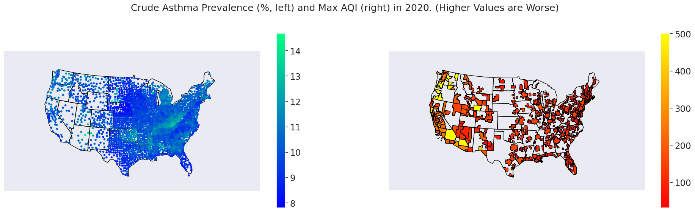

# Introduction

<!-- A short paragraph introducing your project to the audience and a motivation for why this project is important. It’s fine to say your group has an interest in this topic and were keen to explore it more. -->

As time proceeds, pollution from industries is steadily making the air quality in our atmosphere worse, due to pollutants from manufacturing. As a group, we were interested in how different parameters can effect regional air quality both instantaneously and over time, and also how those parameters can effect asthma prevalence. 

# Exploratory Data Analysis

<!--  A summary of the **highlights** of your EDA, where you can show some visualizations of the exploratory data analysis your group did. --> 

For our exploratory analysis, we mostly focused on wether or not there were any correlations that we were expecting, or not expecting. To do that, one of the things we did was aggregate the different air quality parameters into heatmap, which did indicate that some of the expected correlations are there. Furthermore, a choropleth of AQI by region, and point based asthma prevalence was generated to check if there were any potential trends, or if it was truly random. These plots are shown below:

# Questions and Results

## Question 1

<!--  Clearly state your research question, and include 2-3 visualizations that helped you answer your research question. You can create multi-panel figures, but each of your visualizations must speak directly to your research question, and any insights you were able to get from it should be clearly articulated in the figure caption/description. -->

Our first research question was how so different chemicals effect air quality ratings, specifically the main hazardous components in fuels for motor vehicles or stoves like natural gas/gasoline/diesel fuels (benzenes, sulfurs/oxides of nitrogens etc), and certain manufacturing wastes, effect AQI, especially over time. Further, based on these particulates, is there a significant difference in air quality change across time in urban vs rural, areas but also generically over time, based on specific particulates in the first part, and if there is any correlations between asthma rates in different areas and the levels of pollutants there for 2020 specifically.

Looking at the US as a whole, from the [heatmap](./images/gavin-heatmap.png), the Air Quality is most directly died to Ozone, Carbon Monoxide, and Nitro (NOx) compounds, with a lower dependence on Sulfur Dioxide, a common output from burning certain fuels like diesel and some natural gasses.

Looking at the [plot](./images/gavin-plot-1.png) of Max AQI against Crude Asthma prevalence, there is a relation that can be seen in certain areas between asthma and AQI, in Washington, Oregon, Arizona, and New Mexico. However, looking on the eastern portion of the US, AQI is much lower, but on the states west of the eastern coast states, a band of relatively higher asthma prevalence can be seen, indicating that AQI is a bad predictive index for asthma on it own. Further, AQI tends to be higher on the west coast, due to the more frequent and large wildfire events[^1] on the west coast, especially in 2020[^2], causing sampling bias in the AQI data. Furthermore, it was noticed that certain places reported AQI of over 500, the maximum value of the US scale, and as such, those values were set to `501`, to differentiate them from values of `500`.

[^1]: [2020 Western US Wildfire Season](https://en.wikipedia.org/wiki/2020_Western_United_States_wildfire_season) - While Wikipedia is not a primary source, it has aggregated information about the extent of wildfires this year, and more complete information is available on the internet if the reader wishes to go into more detail. The exacts of the wildfires are not important for the data analysis here, just that the AQI is highly sample biased on the west coast for 2020.

[^2]: Given the wildfires and as such sampling bias issues identified, the reader may ask why 2020 was chosen as the year for air quality. The asthma data released by the CDC was only for the year 2020 and as such, the most representative year to compare it to air quality was 2020, other years may have different measurements of other populations which could skew analysis further, and since the main particulates from wildfire smoke (PM2.5, PM10, and $\text{CO}_2$) are not being analyzed here, the wildfires will not effect the analysis very much overall.

Comparing the different aggregated parameters on the [heatmap](./images/gavin-heatmap.png) for 2020 comes the next analysis and [plot](./images/gavin-plot-2.png), Which shows using medium AQI a more representative idea of the parameters the affect asthma and air quality. Comparing asthma data to median AQI shows a stronger corelation, but not enough to be able to judge direct corelation between AQI and asthma prevalence. However, the correlations between AQI and the aggregated parameters seen in the heatmap can be confirmed from this plot, especially in industrial regions like the midwestern, eastern, and southwestern regions of the US. Overall the northwestern US seems to follow the same trends to a lesser extent, sometimes deviating from the trends, especially in urban areas, and certain areas of the US have little to no data, like the northern region of the central US. Analyzing the parameters against asthma shows few correlations, but the ones that exist are fairly strong, with Ozone, Nitrous compounds, and carbon monoxide, all showing fairly strong positive correlations, especially in the corn and tornado belts/alleys of the US.

Finally, the last [plot](./images/gavin-plot-3.png) shows median AQI across time, which shows that over time, there are fluctuations across the country across years, but the northwest trends to slightly lower AQI levels, and the east trends to slightly higher AQI levels, but overall AQI tends to have stayed fairly steady year to year at median[^3] readings from year to year. 

[^3]: Median readings were chosen here over Max AQI to limit the effects of wildfires as discussed above.

In summary, we can find positive correlations between Ozone Levels, Carbon Monoxide, Nitro (NOx) Compounds, with a potential weak correlation with Sulfur Dioxide, an emission from some fuels like diesel and natural gas. Futhermore, There is not a direct correlation between AQI and Crude asthma prevalence in the US, however comparing individual groups of parameters shows that there is a correlation between Ozone, Nitro (NOx) Compounds, and Carbon Monoxide, at least in certain portions of the US (corn and tornado belts/alleys), which show there is not a difference between rural and urban areas necessarily. A final analysis across times showed that AQI does not vary massively across time, at least over the time period investigated, and the minor variations across years are not significant, especially once differences due to wildfire events[^1] have been taken into account.

*Note:* A more in context analysis can be seen in the jupyter notebook from which analysis was done, which can be found [here](./analysis/analysis1.ipynb).

## Question 2

<!--  Clearly state your research question, and include 2-3 visualizations that helped you answer your research question. You can create multi-panel figures, but each of your visualizations must speak directly to your research question, and any insights you were able to get from it should be clearly articulated in the figure caption/description. -->

# Summary

<!-- A brief paragraph that highlights your key results and what you learned from doing this project. -->

In conclusion, connections between certain parameters, including but not limited to  carbon monoxide, ozone, sulfur dioxide, and nitro (NOx) compounds do have relatively strong effects on AQI, and a subset of those parameters appear to effect asthma prevalence. Furthermore, across the last 10 years, there have been no statistically significant changes in regional air quality[^1][^4].

[^4] While there are some small changes in median AQI across years, it is not enough to be considered significant. See [this](./images/gavin-aqi-violinplot.png) plot.
